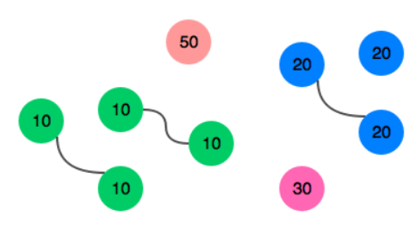

Hay una gran pila de calcetines que deben emparejarse por color. Dada una serie de números enteros que
representan el color de cada calcetín, determine cuántos pares de calcetines con colores iguales hay.

#### Ejemplo  
n = 7  
ar[i] = [1,2,1,2,2,3]  
 
Hay un par de colores 1. y uno de color 2. Quedan tres calcetines impares,
uno de cada color. el numero de parejas es. 2

### Función descriptiva:  
Complete la función sockMerchant en el editor a continuación.
sockMerchant tiene los siguientes parámetros:

*int n*: el número de calcetines en la pila  
*int ar[n]*: los colores de cada calcetín

### Devoluciones
int: el número de pares

### Formato de entrada
La primera línea contiene un número entero N, el número de calcetines representados en ar.
La segunda línea contiene N enteros separados por espacios, ar[i], los colores de los calcetines en el montón.

### Restricciones
`` 1 <= n <=100``  
`` 1 <= ar[i] <=100 dónde 0 <= i <= n`` 

### Entrada de muestra
~~~
 STDIN                        Function
 -----                        --------
 9                            n = 9
 10 20 20 10 10 30 50 10 20   ar = [10, 20, 20, 10, 10, 30, 50, 10, 20]
~~~

### Salida de muestra
~~~
3
~~~
Explicación:  
Hay tres pares de calcetines.

 
 
