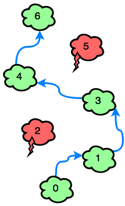
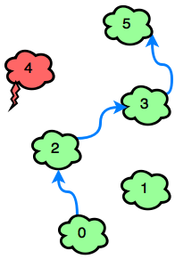

Hay un nuevo juego móvil que comienza con nubes numeradas consecutivamente. Algunas de las nubes son cabezas de tormenta y otras son cúmulos. El jugador puede saltar sobre cualquier cúmulo que tenga un número igual al número de la nube actual máso. El jugador debe evitar los nubarrones. Determine el número mínimo de saltos que se necesitarán para saltar desde la posición inicial hasta la última nube. Siempre es posible ganar el juego.

Para cada juego, obtendrás una serie de nubes numeradas. **0** si son seguros, si son **1** se deben evitarse.

#### Ejemplo
~~~
c = [0,1,0,0,0,1,0]
~~~
Indexar la matriz desde **0...6**. El número de cada nube es su índice en la lista, por lo que el jugador debe evitar las nubes en los índices **1**y **5** . Podrían seguir estos dos caminos:
~~~
0 -> 2 -> 4 -> 6
0 -> 2 -> 3 -> 4 -> 6
~~~
 El primer camino lleva **3** saltos, mientras el segundo toma **4**. 
 Devolver **3**.

#### Función descriptiva
Complete la función jumpingOnClouds en el editor a continuación.

jumpingOnClouds tiene los siguientes parámetros:

- int c[n] : una matriz de enteros binarios

#### Devoluciones
- int: el número mínimo de saltos necesarios

#### Formato de entrada

La primera línea contiene un número entero. **n**, el número total de nubes. La segunda línea contiene **n** enteros binarios separados por espacios que describen nubes **c[i]** dónde **0 <= i <= n**.

#### Restricciones
~~~
2 <= n <= 100
c[i] {0,1}
c[0] = c[n - 1] = 0
~~~

#### Formato de salida
Imprime el número mínimo de saltos necesarios para ganar el juego.

#### Entrada de muestra 0
~~~
7
0 0 1 0 0 1 0
~~~

#### Salida de muestra 0
~~~
4
~~~

#### Explicación 0:
El jugador debe evitar c[2] y c[5]. El juego se puede ganar con un mínimo desaltos 4:
 

#### Entrada de muestra 1
~~~
6
0 0 0 0 1 0
~~~

#### Salida de muestra 1
~~~
3
~~~

#### Explicación 1:
La única nube tormentosa que se debe evitar es c[4]. El juego se puede ganar en 3 saltos:
 
